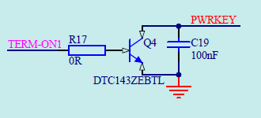
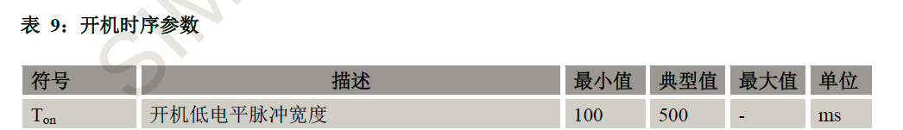
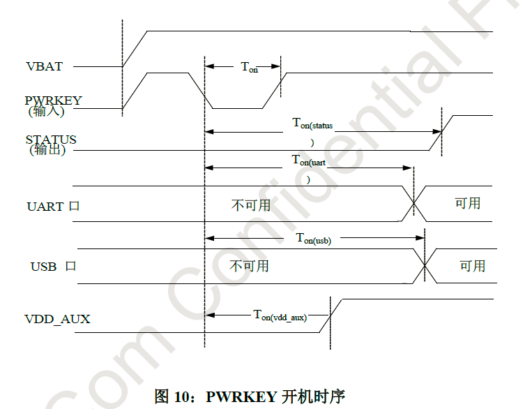
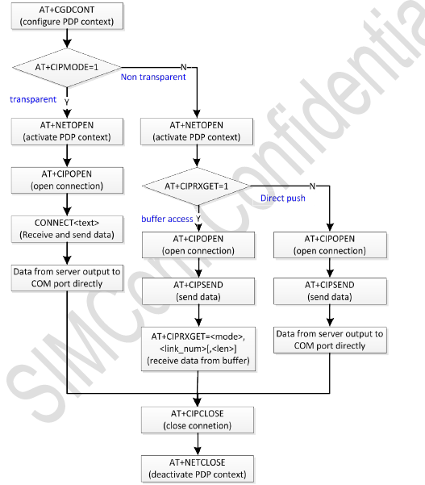

# iec101

## 程序移植

### 需求

1. 将MG301.c中的AT指令从MG323-B上网模块移植到SIM7600CE上网模块；
2. 移植后所有功能保持与原来一致；
3. 移植后的程序可以在新的硬件平台上运行并正常收发数据。

### 资料

1. MG301.c和MG301.h程序源代码；
2. MG323-B上网模块AT指令手册；
3. SIM7600CE上网模块AT指令手册。

## 程序修改

### 上电时序







上电时序为低电平脉冲达到一定时间，参考典型值程序中设定为500ms。将GPIOB15拉高，延时500ms后，把GPIOB15拉低。

### 测试模式



```{main.c}
#ifdef DEBUG_MODE
		GPIO_SetBits(GPIOB, GPIO_Pin_15); //拉低GPRS模块开机引脚电平
		DelayMs(500);
		GPIO_ResetBits(GPIOB, GPIO_Pin_15);
		USART3_InitRXbuf();
		USART3_SendDataToGPRS("AT+CSQ\r", strlen("AT+CSQ\r"));
		DelayMs(20);
		ReceiveLength = Supervise_USART3(ReceiveData);
		USART3_SendDataToGPRS("AT+CGDCONT=1,\"IP\",\"CTNET\"", strlen("AT+CGDCONT=1,\"IP\",\"CTNET\""));
		DelayMs(20);
		ReceiveLength = Supervise_USART3(ReceiveData);
		USART3_SendDataToGPRS("AT+CIPMODE=1", strlen("AT+CIPMODE=1"));
		DelayMs(20);
		ReceiveLength = Supervise_USART3(ReceiveData);
		USART3_SendDataToGPRS("AT+NETOPEN", strlen("AT+NETOPEN"));
		DelayMs(20);
		ReceiveLength = Supervise_USART3(ReceiveData);
		USART3_SendDataToGPRS("AT+CIPOPEN=0,\"TCP\",\"218.29.54.111\",20001", strlen("AT+CIPOPEN=0,\"TCP\",\"218.29.54.111\",20001"));
		DelayMs(20);
		ReceiveLength = Supervise_USART3(ReceiveData);
		USART3_SendDataToGPRS("Hello, TCP", strlen("Hello, TCP"));
		USART3_SendDataToGPRS("+++", strlen("+++"));
		DelayMs(20);
		ReceiveLength = Supervise_USART3(ReceiveData);
		USART3_SendDataToGPRS("ATO", strlen("ATO"));
		DelayMs(20);
		USART3_SendDataToGPRS("Hello, IP", strlen("Hello, IP"));
		USART3_SendDataToGPRS("+++", strlen("+++"));
		DelayMs(20);
		USART3_SendDataToGPRS("AT+CIPCLOSE=0", strlen("AT+CIPCLOSE=0"));
		DelayMs(20);
		USART3_SendDataToGPRS("AT+NETCLOSE", strlen("AT+NETCLOSE"));
		DelayMs(20);
```

测试模式采用透传模式，设置完模式以及网络连接之后，用UART通信直接发送读取数据，作为硬件通讯测试。

测试模式代码如下所示：

### 文件修改


正常使用时采用数据模式中的缓冲器模式，利用CIPSEND发送数据，CIPRXGET读取返回信息。

MG301.c文件的修改主要是AT指令的修改以及上电时序的修改。

## 程序开发

### 目录结构

```
.
├── doc //开发文档
│   └── ...
├── images //图片
│   └── ...
├── Project //工程文件
│   ├── ARM-MDK
│   │   └── ...
│   ├── EWARM
│   │   └── ...
│   └── SI
│       └── ...
├── README.md
└── Source //代码
    ├── STM32F10x_StdPeriph_Lib_V3.5.0 //库
    │   └── ...
    └── User //用户代码
        └── ...
```

### 开发约定

- 缩进: <kbd>Tab</kbd>
- 风格: R & K
